## Project Overview 

---

## Introduction
### Our Task 

We are a new new Business group at a PA Asset Management firm tasked with leading the firms integration of Digital Assets with traditional investment porfolios. The firm is interested in exploring how two digital assets, Bitcoin & Ethereum, into its traditional investment stragegy for Conservative, Moderate, & Agressive pofilios. Our task is to recommend which & how much Digital Asset should be paied with each traditional porfolio risk profile. Subsequently, based on Market Data in the state recommend Markets to which these porfolios can be targeted too. 

For this Analysis we will need to answer: 
1. Analyze the results of the last 5 years for a traditonal Conservative, Moderate, & Agressive Porfolio for a baseline. 
2. Analyse the risk profile of Bitcoin & Eethereum: How do Ethereum and Bitcoin compare with the broader market, as represented by S&P500 Index?
3. Recomend how much of each Digital Assets should be combined with each Traditonal profilio & anlayze the outcome 
4. Anlayze Pennsylvania Census Data to recommend markets for each Porfolio 

---

## Data Sources 
Data for this presentaion was found in three parts: 
1. We research the make up of Traditional Pofolios & incorprated assets that fit the risk profolio of each profilio. 
* Conservative includes: BIV, BSV, VB, VV, VXUS
* Moderate & Agressive include: BND, VB, VV, VWO, VXUS

(Data Soruce API)

2. Bitcoin & Eethereum choosen for thier breath of data & Name recongnition to novice digital investors 

(Data Soruce from Google Finance for the last 5 years & saved as a CSV)
3. S&P data from Google Finance 

4. PA Market Data: Household Income Data Sourced from Kaggle pull from Census API
---

## Data Analysis
#### Part 1. Anlysis of Traditional Pofolios 
1. Import  Libraries & Depencencies, Load .env variables, Set alpaca key and Secret key
2. Set weigths of a Conservative Moderate & Aggresive porfolios 
3. Run a Monte Carolo Simulation of a Conservative Porfolio: Plot Returns & Note Summary Statistics

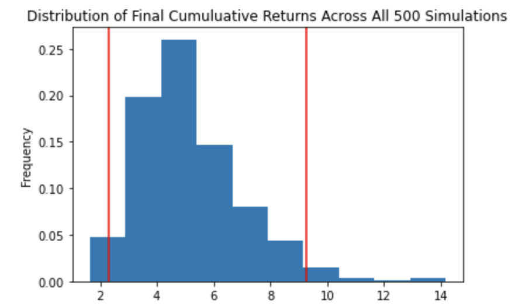
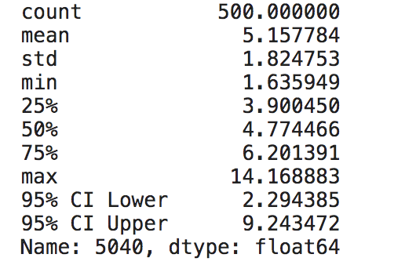
4. Run a Monte Carolo Simulation of a Moderate Porfolio: Plot Returns & Note Summary Statistics

5. Run a Monte Carolo Simulation of a Agressive Porfolio: Plot Returns & Note Summary Statistics
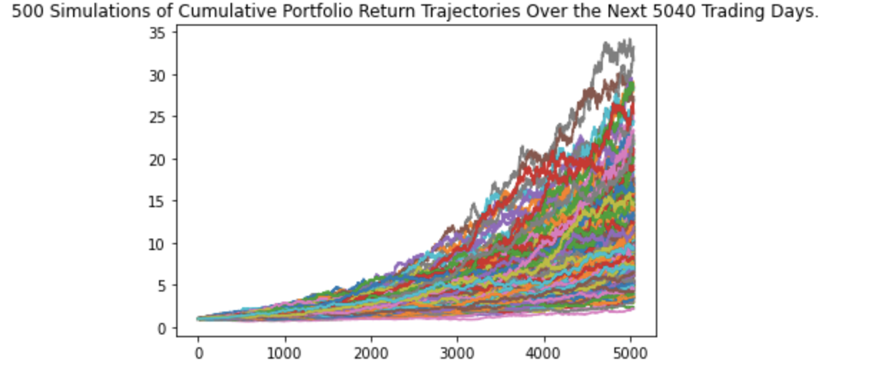

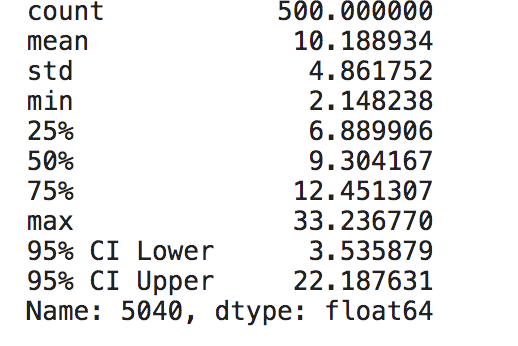
6. Calculate & Plot Returns of each simulation

7. Calulate Porfolio Betas & Sharpe Ratios 
8. Summarize Benchmark Statistics 

### Part 2. Analysis of the risk profiles of Bitcoin & Eethereum. (See Jupyter Lab XXX for detailed script) 
1. Import  Libraries & Depencencies 
2. Read and Process Bitcoin, Eethereum, & SPY Data. Steps include: Setting the path, sorting the index, organizing close prices by date, preparing multi level index for monte Carlo Anlaysis
3. Calculate & Plot Daily Returns for each (Line Chats)

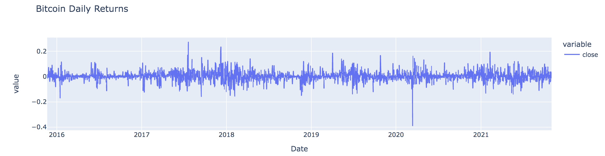

4. Prepare a Pandas Dataframes for Concatenation of Daily Returns 
5. Blend Bitcoin & Eethereum with S&P, then prepare a Box Plot of Daily Returns

6. Calculate and Plot Rolling 1y Volatility Plots using standard deviation function

7. Calculate Cumulative Returns & Plot 

8. Calculate Rolling Three Month Betas & Plot 

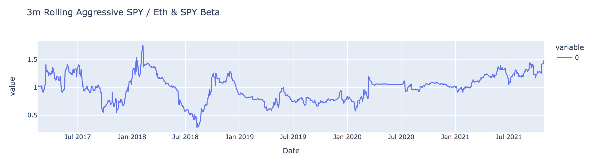

9. Using a Monte Carlo Anlaysis perform a one year projection of Ethereum. Plot Daily Returns of the simulation. Then simulate behavior of a $10,000 Inbvestment & Plot Returns
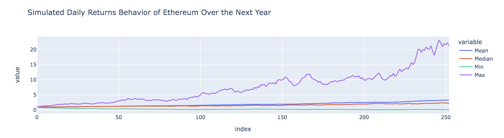

10. Using a Monte Carlo Anlaysis perform a one year projection of S&P. Plot Daily Returns of the simulation. Then simulate behavior of a $10,000 Inbvestment & Plot Returns.

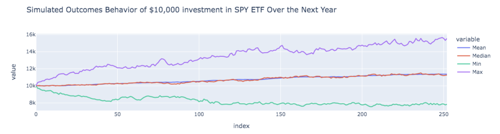
11. Using a Monte Carlo Anlaysis perform a one year projection of Bitcoin. Plot Daily Returns of the simulation. Then simulate behavior of a $10,000 Inbvestment & Plot Returns.
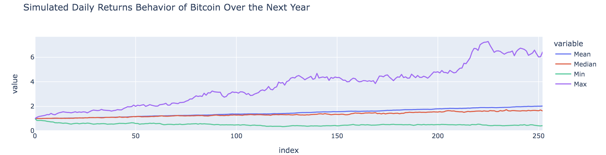
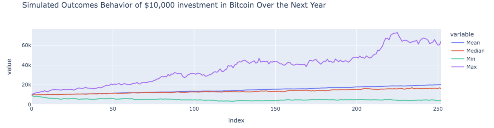
12. Create a dashboard to compare Outcomes of the three simulations 
13. Analyse results. xxxxx

## Part 3. Anlysis of Combined Porfolios
1. From the end of the analysis in PArt 1 Combine data gathered for digital assets in part 2 with the porfolios in part 1. 
* Set Porfolio weights 
* Clean data to show close prices 
2. Define assets and weights for conservative portfolio with 2% digital assets
3. Define assets and weights for moderate portfolio with 5% digital assets
4. Define assets and weights for aggressive portfolio with 10% digital assets
5. Find cumulative returns for all 3 portfolios with digital assets
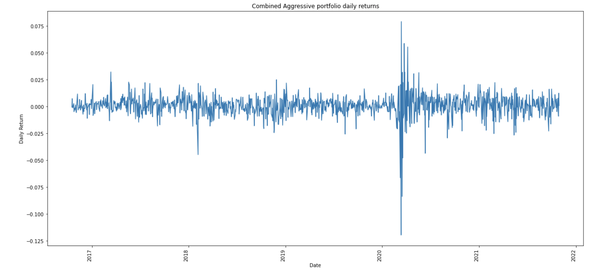

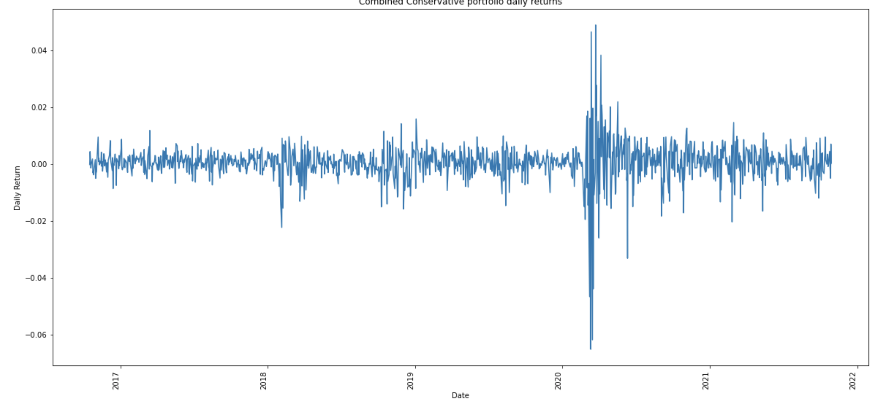
6. Run a Monte Carolo Simulation of a Conservative Porfolio: Plot Returns & Note Summary Statistics
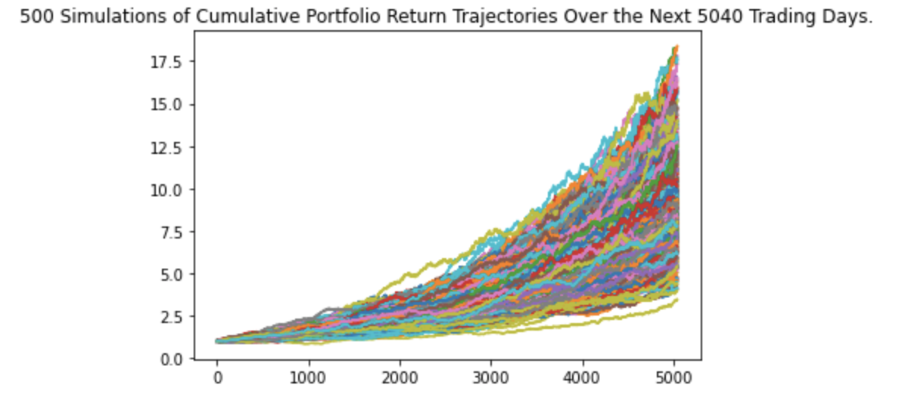
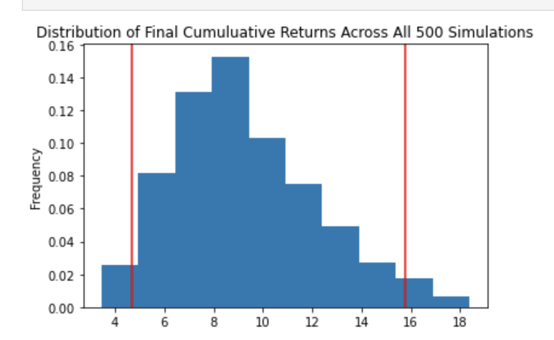
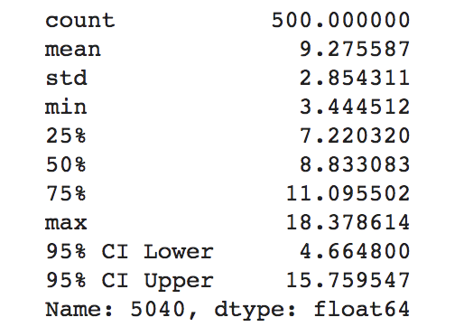

7. Run a Monte Carolo Simulation of a Moderate Porfolio: Plot Returns & Note Summary Statistics

8. Run a Monte Carolo Simulation of a Agressive Porfolio: Plot Returns & Note Summary Statistics

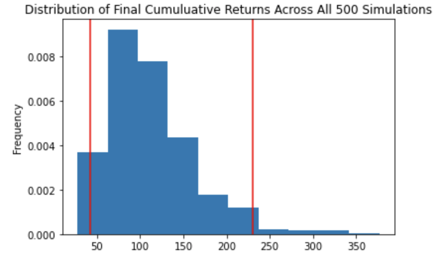

9. Find Beta and Sharpe Ratios for all portfolios
10. Summarize results

## Part 4. Anlysis of PA Household Income Data
1. Import  Libraries & Depencencies, Load .env variables, Set alpaca key and Secret key
2. Loadin in Census Data sourced from Kaggle 
3. Creat a Mapbox Plot to visulatize the Market Data. 
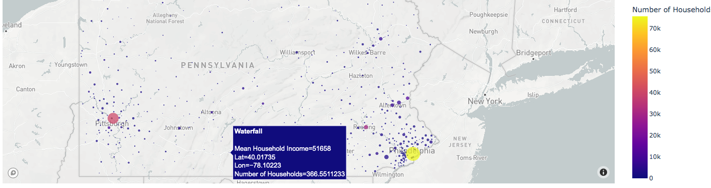
4. Analyse the results to recommend markets to taget each porfolio

--- 

## Conclusions & Results 

---

## Implications 

